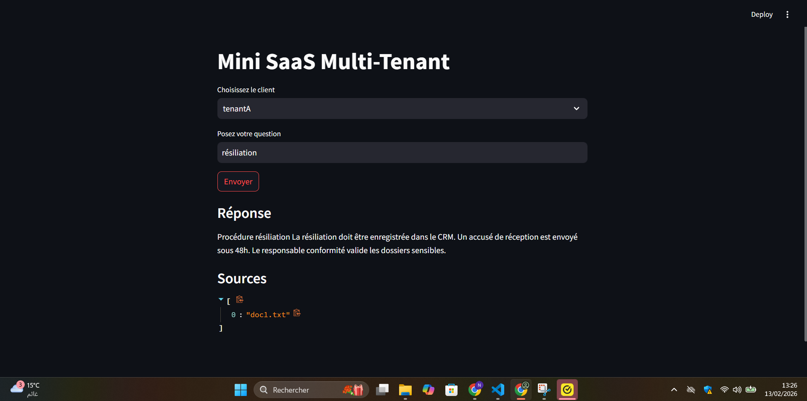
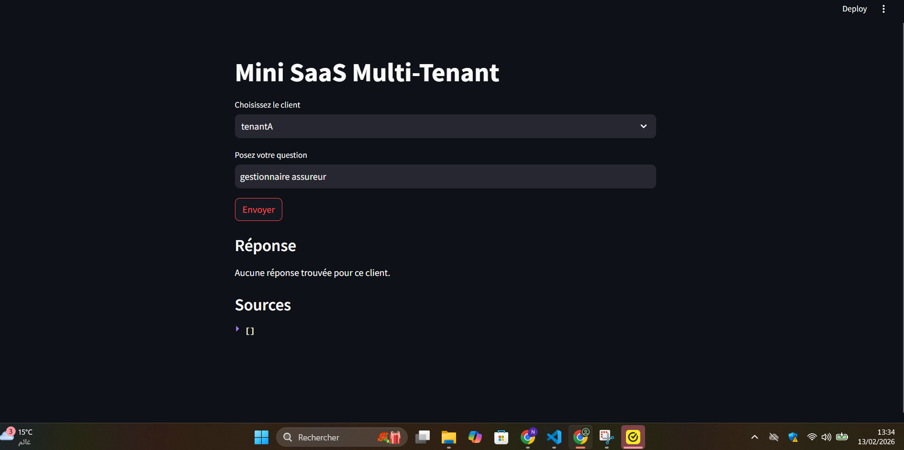
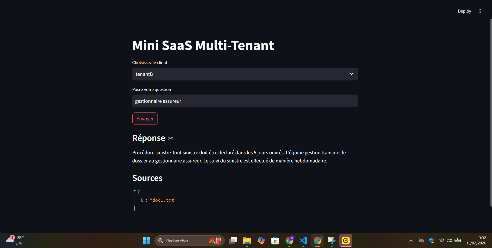

Mini SaaS Multi-Tenant — README
## Project Screenshots

1️⃣ Lancer le backend
cd backend
uvicorn main:app --reload --host 0.0.0.0 --port 8000

2️⃣ Lancer l’interface
streamlit run streamlit_app.py

3️⃣ Tester tenantA et tenantB

TenantA

API key: tenantA_key

Example question: résiliation → should return tenantA’s document only

TenantB

API key: tenantB_key

Example question: gestionnaire assureur → should return tenantB’s document only

4️⃣ Cas “aucune réponse”

Ask a question that doesn’t exist in the tenant’s docs

Example: tenantA → question: gestionnaire assureur → should return empty answer and sources
